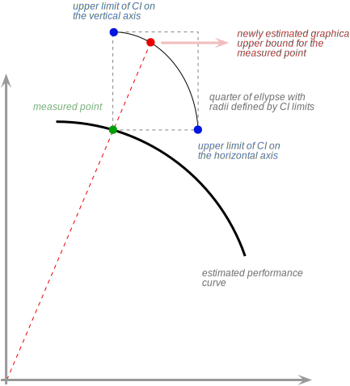

.. coding=utf-8

.. _bob.measure.ci:

===================================
 Credible and Confidence Intervals
===================================

.. _bob.measure.ci.credible:

Credible Interval (or Region)
-----------------------------

A `Credible Interval <credible-interval_>`_ or region (for multi-dimensional
cases) for parameter :math:`x` consists of a lower estimate :math:`L`, and an
upper estimate :math:`U`, such that the probability of the true value being
within the interval estimate is equal to :math:`\alpha`.  For example, a 95%
credible interval (i.e.  :math:`\alpha = 0.95`) for a parameter :math:`x` is
given by :math:`[L, U]` such that

.. math::
   P(k \in [L,U]) = 95\%

The smaller the test size, the wider the confidence interval will be, and the
greater :math:`\alpha`, the smaller the confidence interval will be.  The
evaluation of credible intervals follows a bayesian approach, where one assumes
a prior probability density function that models the likelihood of the
parameter, given its possible range.  Once the prior function is established,
the Bayes theorem is used to devise the posterior distribution of the
parameter given its current estimate, and to calculate the credible interval.

Background
==========

In binary classification problems **where each sample is i.i.d.** (independent
and identically distributed random variables), success/failure tests are
binomially distributed (that is, composed of a number :math:`n` of Bernoulli
trials using a biased coin with "unknown" proportion :math:`p`):

.. math::
   P (K = k\mid p) = \binom{n}{k} p^k (1-p)^{n-k}

where:

* :math:`n` is the total number of trials for a particular experiment,
* :math:`k` is the number of successes within those trials, and
* :math:`p` is the true probabibility, which is unknown, and that we are trying
  to estimate from experiments.

To estimate :math:`p`, the true value for the unknow probability, given
:math:`k`, the number of successes observed in a concrete experiment, we apply
the Bayes theorem:

.. math::
   P(p\mid k) = \frac{P(k\mid p) P(p)}{P(k)}

The value of :math:`P(k)` does not depend on :math:`n` and can be recast as a
marginalized version of :math:`P(k\mid p)`, which will help us later:

.. math::
   P(p\mid k) &= \frac{P(k\mid p) P(p)} {P(k)} \\
              & = \frac{P(k\mid p) P(p)} {\int_{p'} P(k, p') dp'} \\
              & = \frac{P(k\mid p) P(p)} {\int_{p'} P(k\mid p') P(p') dp'}

In the case of a binomial distribution, :math:`P(k\mid p)` is known (first
equation).  :math:`P(p)` is normally called the *prior* probability density,
and corresponds to a known (or most likely) density distribution for the
parameter :math:`p`.  The choice of this prior will of course affect the
overall aspect of the posterior distribution :math:`P(p\mid k)` we are trying
to estimate.

A typical choice for this prior is a `Beta distribution`_.  As it turns out, a
Beta prior will generate a (conjugate) Beta posterior:

.. math::
   P(p\mid k) = \frac{1}{B(k+\alpha,n-k+\beta)} p^{k+\alpha-1}(1-p)^{n-k+\beta-1}

This formulation provides us with a complete representation for the posterior
of :math:`p`, allowing the calculation of credible intervals, via integration.
The values :math:`\alpha` and :math:`\beta` are hyper-parameters which control
the skewness of the Beta distribution towards the maximum or the minimum
respectively.  As there is no reason to favour one more than the other, these
are typically set to matching values :math:`\alpha=\beta=\lambda`.

.. math::
   P(p\mid k) = \frac{1}{B(k+\lambda,n-k+\lambda)} p^{k+\lambda-1}(1-p)^{n-k+\lambda-1}

Two classical settings are often used:

* :math:`\lambda = 1` (a.k.a. a "flat" prior)
* :math:`\lambda = 0.5` (a.k.a. Jeffrey's prior)

In practice, changing :math:`\lambda` does not affect much the credible
interval calculation.  To calculate the credible interval for a binary variable
using a flat or Jeffrey's prior, use
:py:func:`bob.measure.credible_region.beta`, providing :math:`k`,
:math:`l=(n-k)`, :math:`\lambda` and how much coverage you would like to have
(typically 0.95 - 95%).

.. _bob.measure.ci.figures:

Applicability to Figures of Merit in Classification
===================================================

[GOUTTE-2005]_ extended this analysis to classifical figures of merit in
classification, with a similar reasoning as used for accuracy on the previous
section:

* Precision or Positive-Predictive Value (PPV): :math:`p = TP/(TP+FP)`, so
  :math:`k=TP`, :math:`l=FP`
* Recall, Sensitivity, or True Positive Rate: :math:`r = TP/(TP+FN)`, so
  :math:`k=TP`, :math:`l=FN`
* Specificity or True Negative Rage: :math:`s = TN/(TN+FP)`, so :math:`k=TN`,
  :math:`l=FP`
* Accuracy: :math:`acc = TP+TN/(TP+TN+FP+FN)`, so :math:`k=TP+TN`,
  :math:`l=FP+FN`
* Jaccard Index: :math:`j = TP/(TP+FP+FN)`, so :math:`k=TP`, :math:`l=FP+FN`

The function :py:func:`bob.measure.credible_region.measures` can calculate the
above quantites in a single shot from counts of true and false, positives and
negatives, the :math:`\lambda` parameter, and the desired coverage.

.. note::

   For comparing two systems according to their F1-score, please see
   :ref:`bob.measure.ci.compare`.

.. _bob.measure.ci.confidence:

Confidence Interval
-------------------

A `confidence interval`_ corresponds to a *frequentist* approach to the
estimation of a range of values for an unknown parameter :math:`p`.  More
formally, a 95% confidence interval means that with a large number of `n`
repeated Bernoulli trials, 95% of times, the estimated interval would include
the true value of the parameter.  Where as in the Bayesian approach the
interval is fixed and the parameter :math:`p` is subject to random process, in
the frequentist approach, the parameter :math:`p` is fixed and the interval is
subject to randomness.

There are several proposed ways to calculate a confidence interval, some of
which are implemented in this package.  They differ by the "conservativeness",
or how large the interval will be for the same coverage.  Except for specific
method parameterization (:math:`\lambda`), they should (almost) work as a
drop-in replacement for :py:func:`bob.measure.credible_region.beta`:

* Wilson, 1927, [WILSON-1927]_:
  :py:func:`bob.measure.confidence_interval.wilson`
* Clopper-Pearson, 1934, [CLOPPER-1934]_:
  :py:func:`bob.measure.confidence_interval.clopper_pearson`
* Agresti-Coull, 1998, [AGRESTI-1998]_:
  :py:func:`bob.measure.confidence_interval.agresti_coull`

.. _bob.measure.ci.conservativeness:

Conservativeness
----------------

When talking about credible or confidence intervals, one the most important
aspect relates to the method conservativeness.  A method that is too
conservative (pessimistic) will tend to provide larger than required intervals
that surpass the required coveraged.  If you are using this to compare systems
(e.g. compare models A and B performance through the same database), then a
too-pessimistic approach may result in overlapping performance intervals for
both systems.  Therefore, it is preferrable to use a technique that is as
precise as possible.

Estimating conservativeness is a difficult task.  The main problem relates to
the underlying hypothesis samples are issued from a binomial distribution
(i.e., are true Bernoulli trials).  Considering that to be true, you can test
the various methods coverage regions through simulation.  The function
:py:func:`bob.measure.curves.estimated_ci_coverage` can help you with that
task, and provides an usage example for the various intervals implemented in
this package:

.. plot:: examples/coverage.py

.. _bob.measure.ci.compare:

Comparing 2 systems
-------------------

According to [GOUTTE-2005]_, 2 distinct systems may be compared by considering
either two specific use-cases: if both systems are exposed to the same (paired
comparison) or different data (unpaired).  As a rule of thumb, paired tests
carry stronger constraints and therefore have the potential provide more
sensitive credible intervals.

Unpaired comparison
===================

To perform an unpaired comparison of two systems, we first assume each system
have a fixed threshold and therefore can produce two sets of true and false
positive and negative scores.  Under these conditions, one may compare two
figures of merit (:ref:`bob.measure.ci.figures`), taken as base their posterior
beta distributions.  This cannot be done analytically, so we resort to a `Monte
Carlo simulation`_.  In the following example, we compare the precision and
recall of two systems previously tuned.

.. plot:: examples/precision-comparison.py

From this, we can assert that system's 2 precision is only 65% (empirically)
likely to be better than system's 1 precision.  A test for a 95% credible
interval, in this case, would fail.  Of course, we can apply the same reasoning
for the recall.

.. plot:: examples/recall-comparison.py

Here, we see that there is only a 24% probability that system's 2 recall is
better than system 1.  Again, a check for a 95% margin would fail.

Comparing F1-Scores
~~~~~~~~~~~~~~~~~~~

Comparing F1-scores cannot be done with the procedure above, using a Beta
posterior, according to [GOUTTE-2005]_.  We resort again to Monte Carlo
simulations for this.

.. plot:: examples/f1-comparison.py

From this, we cannot assert that neither system's 1 or 2 F1-score is greater
than the other one with a 95% confidence.

ROC and Precision Recall Curves
~~~~~~~~~~~~~~~~~~~~~~~~~~~~~~~

It is often useful to explore multiple thresholds at the same time, instead of
tuning each system to a set of thresholds.  This package allows you to plot ROC
and Precision-Recall curves including credible/confidence interval bounds.  We
simply repeat the procedure above for each threshold and plot the results.  The
bounds of the curve are calculated taking into consideration the credible
interval at that particular point, in all four directions.  The calculation of
the upper bound for a typical performance curve is examplified below:

The lower bounds of a performance curve are calculated using the same
principle, using the lower ellypse formed by the lower bounds of the credible
interval.

Here is an example on how to use the built-in procedures for plotting ROC
curves:

.. plot:: examples/roc-ci.py

The plotting procedure produces the area under the ROC curve (AUROC) for all
three curves: the normal ROC, as well as the lower and upper bounds, which
allows for the estimation of the 95% credible interval of that measure.  In
this example, it is possible to observe both system performances overlap a bit,
from the perspective of the AUROC.  A more thorough analysis would require the
selection of a threshold for each system, and a more detailed CI analysis.

We can also create Precision vs. Recall plots.  Here is the above system from
that perspective.

.. plot:: examples/precision-recall-curve-ci.py

With the precision-recall curves, our stock canvas also includes iso-F1 lines,
which show equal-valued F1-score segments.  Also on this view, both systems
present significant overlap in terms of the area under the PR curve (AUPRC).

Paired comparison
=================

The paired (binary) comparison described in [GOUTTE-2005]_, equations 16 and 19
is implemented.  It is an extension of the bayesian approach described for the
various figures of merit (precision, recall, specificity, etc), by considering
a Dirichlet posterior (generalization of the beta posterior for a multinomial
distribution), with the following parameters:

* :math:`N_1`: then number of times system 1 gets the output right (matches
  label), and system 2 gets it wrong
* :math:`N_2`: then number of times system 2 gets the output right (matches
  label), and system 1 gets it wrong
* :math:`N_3`: then number of times system 1 and 2 outputs match, even if they
  do not match the reference label

.. note::

   In a paired comparison, both systems to be compared (systems 1 and 2) have
   been previously tunned, and output only binary outcomes.  The binary
   outcomes of each system are compared with the reference labels to determine
   correct or incorrect hypotheses.

Notice :math:`N = \sum_i N_i` corresponds to the total number of samples
available for the comparison.  By consequence, :math:`\pi_i = N_i / N`
corresponds to the multinomial probability one of the above outcomes take
place.  The implemented posterior has the following form:

.. math::

   P(\pi|Z,\alpha) = \frac{\Gamma(N + \sum_k \alpha_k)}{\prod_k \Gamma(N_k + \alpha_k)} \prod_k \pi_k^{N_k + \alpha_k -1}

Each `\alpha_k` corresponds to the prior information about the distribution of
each probability.  Typically, a symmetrical prior is used such as Jeoffrey's
(:math:`\alpha_k=0.5`) or flat (:math:`\alpha_k=1`).  Given the various
relationships above, the implemented function inputs only :math:`N_k` and
:math:`\alpha_k`.  The outcome is computed via Monte-Carlo simulation, for
which you must decide on the number of samples.  Values in the order of
millions are typically used for a more precise estimation.

The following piece of code simulates two systems and runs a paired comparison
using the built-in function
:py:func:`bob.measure.credible_region.compare_systems`:

.. testsetup:: paired-comparison

   import numpy
   from bob.measure.credible_region import compare_systems

   numpy.random.seed(1234)
   nb_samples = 50

   # expected output of the system
   labels = numpy.ones(nb_samples, dtype=bool)
   ratio = 0.2
   labels[: int(numpy.ceil(ratio * nb_samples))] = 0
   numpy.random.shuffle(labels)

   # system1 has 10% error, so we flip its bits by that amount randomly
   flip_probability = numpy.random.choice(
       [False, True], p=[0.9, 0.1], size=labels.shape
   )
   system1_output = numpy.logical_xor(labels, flip_probability)
   system1_acc = numpy.count_nonzero(
       ~numpy.logical_xor(system1_output, labels)
   ) / len(labels)

   # system2 has 20% error, so we flip its bits by that amount randomly
   flip_probability = numpy.random.choice(
       [False, True], p=[0.85, 0.15], size=labels.shape
   )
   system2_output = numpy.logical_xor(labels, flip_probability)
   system2_acc = numpy.count_nonzero(
       ~numpy.logical_xor(system2_output, labels)
   ) / len(labels)

.. testcode:: paired-comparison

   print(f"Total number of samples: {nb_samples}")
   print(f"Ratio negatives/positives: {100*ratio:.0f}%")
   print(f"System 1 accuracy: {100*system1_acc:.2f}%")
   print(f"System 2 accuracy: {100*system2_acc:.2f}%")

   # calculate when systems agree and disagree
   n1 = numpy.count_nonzero(
       (~numpy.logical_xor(system1_output, labels))  # correct for system 1
       & numpy.logical_xor(system2_output, labels)   # incorrect for system 2
   )
   n2 = numpy.count_nonzero(
       (~numpy.logical_xor(system2_output, labels))  # correct for system 2
       & numpy.logical_xor(system1_output, labels)   # incorrect for system 1
   )
   n3 = nb_samples - n1 - n2
   print(f"N1: {n1}; N2: {n2}; N3: {n3}")
   prob = compare_systems([n1, n2, n3], [0.5, 0.5, 0.5], 1000000)
   print(f"Prob(System1 > System2) = {100*prob:.2f}%")

.. testoutput:: paired-comparison
   :options: +NORMALIZE_WHITESPACE

   Total number of samples: 50
   Ratio negatives/positives: 20%
   System 1 accuracy: 88.00%
   System 2 accuracy: 82.00%
   N1: 8; N2: 5; N3: 37
   Prob(System1 > System2) = 79.67%

Q&A
---

I'm confused, what should I choose?
===================================

You normally want to use the Bayesian approach with the Beta prior, which has a
more natural interpretation.  The frequentist interpretation is harder to
grasp.  The Bayesian approach with a Beta prior offers a good coverage that is
not too conservative.

What if my sampling is not i.i.d.?
==================================

Then using these estimates is not strictly correct, but often done.  If your
samples are not i.i.d. (e.g. phonemes in a speech sequence, pixels in an
image), then these methods will probably provide an overly optimistic estimate
of the interval (i.e., probably the interval for 95% confidence would be larger
if you considered the sample dependence).

.. note::

   Intuition only.  A reference is missing for this.  If you know of anything,
   please patch this description.

Should I consider the expected value or mode of a credible interval?
====================================================================

TL;DR: Use the mode.

As stated in [GOUTTE-2005]_, Section 2.1, if you are using a flat prior
(:math:`\lambda = 1`), then the mode matches the maximum likelihood (ML)
estimate for the indicator in question.  For example, in the case of precision,
the mode of the posterior will be exactly :math:`TP/(TP+FP)`.  The mode is also
the reference for the interval: a confidence interval of 95% is split in half
at each side of the mode.

The expected value will be a smoothed version of the ML estimate
:math:`(TP+1)/(TP+FP+2)` in the case of precision.

Is there a better way to compare 2 systems?
===========================================

TL;DR: Use our [GOUTTE-2005]_ implementation to compare two systems using the
F1-score, or a paired comparison.

In Machine Learning, one typically wants to compare two (or more) systems when
subject to the same input data (samples).  Interval estimates provided in this
package make no assumptions about the underlying samples used in comparing
different systems.  Therefore, intervals provided by simply applying one of the
techniques described before, may be overly pessimistic **in the condition
systems are subject to the same input samples**.

In the specific case two systems are subject to **the same input samples**, a
paired-test may be more adequate.  Unfortunately, for indicators such as
precision, recall or F1-score, many of the paired-tests available in literature
are not adequate [GOUTTE-2005]_.

The main reason for the inadequacy lies on the constraints imposed by such
tests (e.g. gaussianity or symmetry).  In a well-trained system, we would
expect positive and negative samples to be closely located to the extremes of
the system output range (e.g. inside the interval :math:`[0, 1]`).  Besides
being bounded, each of those distributions are likely composed of uni-lateral
tails.  Hence, differences between outputs of systems may not be approximately
normal.  Here is summary of available paired tests and their
assumptions/adequacy:

* Paired (Student's) t-test (parametric): the difference between system outputs
  should be (*approximately*) normally distributed, whereas it is likely
  to be bi-modal.
* Wilcoxon (signed rank) test (non-parametric): does not assume gaussianity on
  the difference of outputs.  It measures how symmetric the difference of
  outputs is around the median.  Assuming symmetry for the difference of two
  heavily tailed distributions could be quite restricting.
* Sign test (non-parametric): Like Wilcoxon test, but without the assumption of
  symmetric distribution of the differences around the median.  This test would
  be adequate for ML system comparison, but is less sensitive than the two
  precendent ones.
* Bootstrap: A frequentist approach to confidence interval estimation by
  sampling with replacement (differences of) indicators one would want to
  compare.  This would also be adequate as means to compare two systems.

.. include:: links.rst
